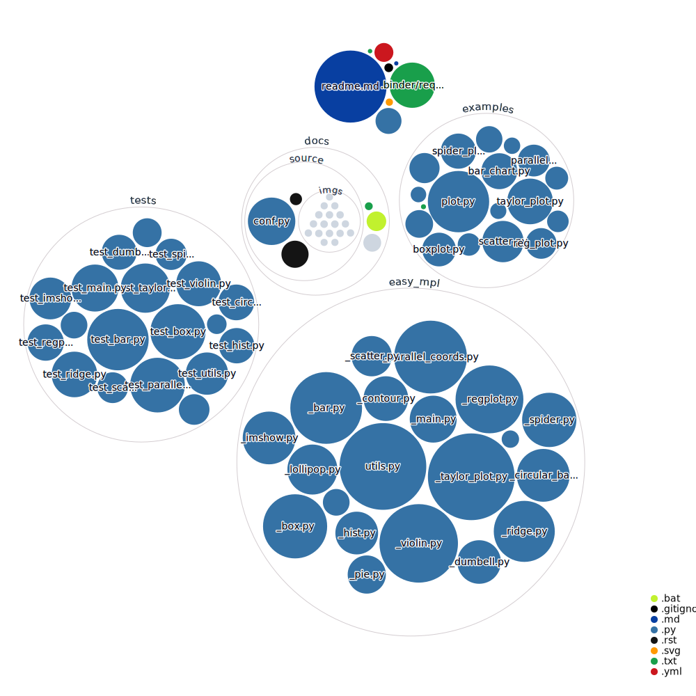

[](https://easy-mpl.readthedocs.io/en/latest/?badge=latest)

[](https://pepy.tech/project/easy-mpl)
[](https://badge.fury.io/py/easy_mpl)


Matplotlib is great library which offers huge flexibility due to its object oriented
programming style. However, **most** of the times, we the users don't need that 
much flexibiliy and just want to get things done as quickly as possible. For example 
why should I write at least three lines to plot a simple array with legend when same 
can be done in one line and my purpose is just to view the array. Why I can't simply
do ```plot(data)``` or ```imshow(img)```. This motivation gave birth to this library.
`easy_mpl` stands for easy maplotlib. The purpose of this is to ease the use of 
matplotlib while keeping the flexibility of object oriented programming paradigm 
of matplotlib intact. Using these one liners will save the time and will not hurt. 
Moreover, you can swap most functions of this library with that of matplotlib and 
vice versa. For more detailed description see [introduction](https://easy-mpl.readthedocs.io/en/latest/auto_examples/intro.html)

# Installation

This package can be installed using pip from pypi using following command

    pip install easy_mpl

# API

[plot](#plot)

[bar_chart](#bar_chart)

[regplot](#regplot)

[imshow](#imshow)

[hist](#hist)

[pie](#pie)

[scatter](#scatter)

[contour](#contour)

[dumbbell_plot](#dumbbell_plot)

[ridge](#ridge)

[parallel_coordinates](#parallel_coordinates)

[spider_plot](#spider_plot)

[taylor_plot](#taylor_plot)

[lollipop_plot](#lollipop_plot)

[circular_bar_plot](#circular_bar_plot)

[boxplot](#boxplot)

[violin_plot](#violin_plot)


# Usage
For a wide range of usage examples see [gallery of examples](https://easy-mpl.readthedocs.io/en/latest/auto_examples/index.html)

## plot

```python
import numpy as np
from easy_mpl import plot

x = np.random.randint(2, 10, 10)

plot(x, '--o', color=np.array([35, 81, 53]) / 256.0,
     ax_kws=dict(xlabel="Days", ylabel="Values"))
```
<p float="left">
  
</p>


## scatter

```python
import numpy as np
from easy_mpl import scatter
import matplotlib.pyplot as plt
x = np.random.random(100)
y = np.random.random(100)
ax, _ = scatter(x, y, colorbar=True)

assert isinstance(ax, plt.Axes)
```
<p float="left">
  
</p>


## imshow

```python
import numpy as np
from easy_mpl import imshow

data = np.random.random((4, 10))
imshow(data, cmap="YlGn",
       xticklabels=[f"Feature {i}" for i in range(data.shape[1])],
       grid_params={'color': 'w', 'linewidth': 2}, annotate=True,
       colorbar=True)
```
<p float="left">
  
</p>


## bar_chart

```python
from easy_mpl import bar_chart

bar_chart(
    [1,2,3,4,4,5,3,2,5],
    ['a','b','c','d','e','f','g','h','i'],
    bar_labels=[11, 23, 12,43, 123, 12, 43, 234, 23],
    cmap="GnBu",
    sort=True)
```
<p float="left">
  
</p>


## hist

```python
import numpy as np
from easy_mpl import hist

data = np.random.randn(1000)

hist(data, bins = 100)
```
<p float="left">
  
</p>


## lollipop_plot

```python
import numpy as np
from easy_mpl import lollipop_plot

y = np.random.randint(0, 10, size=10)
lollipop_plot(y, sort=True, title="sort")
```
<p float="left">
  
</p>


## dumbbell_plot

```python
import numpy as np
from easy_mpl import dumbbell_plot

st = np.random.randint(1, 5, 10)
en = np.random.randint(11, 20, 10)

dumbbell_plot(st, en)
```
<p float="left">
  
</p>

## regplot

```python
import numpy as np
from easy_mpl import regplot

rng = np.random.default_rng(313)
x = rng.uniform(0, 10, size=100)
y = x + rng.normal(size=100)

regplot(x, y, line_color='black')
```
<p float="left">
  
</p>


## ridge

```python
import numpy as np
from easy_mpl import ridge

data = np.random.random((100, 3))
ridge(data)
```
<p float="left">
  
</p>


## pie

```python
from easy_mpl import pie

explode = (0, 0.1, 0, 0, 0)
pie(fractions=[0.2, 0.3, 0.15, 0.25, 0.1], explode=explode)
```
<p float="left">
  
</p>


## contour

```python
import numpy as np
from easy_mpl import contour

_x = np.random.uniform(-2, 2, 200)
_y = np.random.uniform(-2, 2, 200)
_z = _x * np.exp(-_x**2 - _y**2)
contour(_x, _y, _z, fill_between=True, show_points=True)
```
<p float="left">
  
</p>


## circular_bar_plot

```python
import numpy as np
from easy_mpl import circular_bar_plot

data = np.random.random(50, )

circular_bar_plot(data, text_kws={"fontsize": 16})
```
<p float="left">
  
</p>

## parallel_coordinates

```python
import numpy as np
import pandas as pd
from easy_mpl import parallel_coordinates

ynames = ['P1', 'P2', 'P3', 'P4', 'P5']  # feature/column names
N1, N2, N3 = 10, 5, 8
N = N1 + N2 + N3
categories_ = ['a', 'b', 'c', 'd', 'e', 'f']
y1 = np.random.uniform(0, 10, N) + 7
y2 = np.sin(np.random.uniform(0, np.pi, N))
y3 = np.random.binomial(300, 1 / 10, N)
y4 = np.random.binomial(200, 1 / 3, N)
y5 = np.random.uniform(0, 800, N)
# combine all arrays into a pandas DataFrame
data_df = pd.DataFrame(np.column_stack((y1, y2, y3, y4, y5)),
                       columns=ynames)

# using continuous values for categories
parallel_coordinates(data_df, names=ynames,
                     categories=np.random.randint(0, 5, N))
```
<p float="left">
  
</p>


## spider_plot

```python
import pandas as pd
from easy_mpl import spider_plot

df = pd.DataFrame.from_dict(
    {'summer': {'a': -0.2, 'b': 0.1, 'c': 0.0, 'd': 0.1, 'e': 0.2, 'f': 0.3},
     'winter': {'a': -0.3, 'b': 0.1, 'c': 0.0, 'd': 0.2, 'e': 0.15, 'f': 0.25},
     'automn': {'a': -0.1, 'b': 0.3, 'c': 0.15, 'd': 0.24, 'e': 0.18, 'f': 0.2}})
spider_plot(df, xtick_kws={'size': 13}, frame="polygon",
           color=['b', 'r', 'g', 'm'],
            fill_color=['b', 'r', 'g', 'm'])
```
<p float="left">
  
</p>

## taylor_plot

```python
import numpy as np
from easy_mpl import taylor_plot

np.random.seed(313)
observations = {
    'site1': np.random.normal(20, 40, 10),
    'site2': np.random.normal(20, 40, 10),
    'site3': np.random.normal(20, 40, 10),
    'site4': np.random.normal(20, 40, 10),
}

simulations = {
    "site1": {"LSTM": np.random.normal(20, 40, 10),
                "CNN": np.random.normal(20, 40, 10),
                "TCN": np.random.normal(20, 40, 10),
                "CNN-LSTM": np.random.normal(20, 40, 10)},

    "site2": {"LSTM": np.random.normal(20, 40, 10),
                "CNN": np.random.normal(20, 40, 10),
                "TCN": np.random.normal(20, 40, 10),
                "CNN-LSTM": np.random.normal(20, 40, 10)},

    "site3": {"LSTM": np.random.normal(20, 40, 10),
                "CNN": np.random.normal(20, 40, 10),
                "TCN": np.random.normal(20, 40, 10),
                "CNN-LSTM": np.random.normal(20, 40, 10)},

    "site4": {"LSTM": np.random.normal(20, 40, 10),
                "CNN": np.random.normal(20, 40, 10),
                "TCN": np.random.normal(20, 40, 10),
                "CNN-LSTM": np.random.normal(20, 40, 10)},
}

# define positions of subplots

rects = dict(site1=221, site2=222, site3=223, site4=224)

taylor_plot(observations=observations,
            simulations=simulations,
            axis_locs=rects,
            plot_bias=True,
            cont_kws={'colors': 'blue', 'linewidths': 1.0, 'linestyles': 'dotted'},
            grid_kws={'axis': 'x', 'color': 'g', 'lw': 1.0},
            title="mutiple subplots")
```
<p float="left">
  
</p>

## boxplot

```python
import pandas as pd
from easy_mpl import boxplot
from easy_mpl.utils import _rescale
f = "https://raw.githubusercontent.com/AtrCheema/AI4Water/master/ai4water/datasets/arg_busan.csv"
df = pd.read_csv(f, index_col='index').iloc[:, 0:10]
for col in df.columns:
    df[col] = _rescale(df[col])

boxplot(df,
        fill_color="GnBu",
        notch=True,
        patch_artist=True,
        medianprops={"color": "black"})
```
<p float="left">
  
</p>

## violin_plot

```python
import matplotlib.pyplot as plt
import pandas as pd
from easy_mpl import violin_plot
from easy_mpl.utils import _rescale

f = "https://raw.githubusercontent.com/AtrCheema/AI4Water/master/ai4water/datasets/arg_busan.csv"
df = pd.read_csv(f, index_col='index').iloc[:, 0:10]

for col in df.columns:
    df[col] = _rescale(df[col])

axes = violin_plot(df, show=False)
axes.set_facecolor("#fbf9f4")
plt.tight_layout()
plt.show()
```
<p float="left">
  
</p>

# Code Structure
